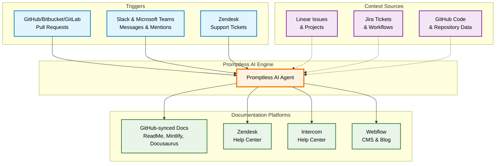

# Core Concepts

Promptless automates documentation creation and maintenance through three interconnected components that work together to understand your codebase, gather context, and publish updates to your documentation platforms.

## Overview

The diagram below illustrates how triggers, context sources, and documentation platforms interact within the Promptless ecosystem:

## How the Components Work Together

### 1. Triggers Initiate the Process

**Triggers** are the starting point for all documentation updates. They monitor various sources for events that might require documentation changes:

- **Code Changes**: Pull requests in GitHub, Bitbucket, or GitLab automatically trigger analysis when new features or fixes are introduced
- **Team Communication**: Slack messages and Microsoft Teams mentions can trigger documentation updates
- **Support Patterns (Beta)**: Zendesk tickets help identify gaps in documentation based on recurring user questions

### 2. Context Sources Enrich Promptless's Understanding

**Context Sources** enhance the AI's understanding by providing real-time access to your organization's data:

- **Project Management**: Linear issues and Jira tickets provide business context and feature requirements
- **Code Repository**: GitHub integration gives deep understanding of your codebase structure and recent changes
- **Historical Data**: Past documentation patterns and team workflows inform better suggestions

<Note>
Context sources are queried in real-time and no customer data is stored by Promptless, ensuring your sensitive information remains secure.
</Note>

### 3. Documentation Platforms Receive Updates

**Documentation Platforms** are where the final documentation updates are published:

- **GitHub-synced Platforms**: Most common setup where docs are stored in Git and synced to hosting providers
- **Direct Platform Integration**: Beta support for publishing directly to Zendesk, Intercom, and Webflow
- **Multi-platform Publishing**: Single trigger can update multiple documentation platforms simultaneously

## Key Benefits of This Architecture

<CardGroup cols={2}>
  <Card title="Automated Workflow" icon="fa-regular fa-arrows-rotate">
    Triggers automatically detect when documentation updates are needed, eliminating manual monitoring
  </Card>
  
  <Card title="Contextual Intelligence" icon="fa-regular fa-brain">
    Context sources provide the AI with deep understanding of your organization's specific needs and terminology
  </Card>
  
  <Card title="Flexible Publishing" icon="fa-regular fa-share-nodes">
    Support for multiple documentation platforms means you can maintain consistency across all your docs
  </Card>
  
  <Card title="Real-time Processing" icon="fa-regular fa-bolt">
    No data storage means fresh, up-to-date information is always used for documentation generation
  </Card>
</CardGroup>

## Advanced Configuration

For enterprise deployments, you can customize how these components interact:

- **Directory-specific Triggers**: Monitor only specific parts of your codebase
- **Team-scoped Context**: Limit context sources to specific teams or projects  
- **Multi-environment Publishing**: Separate staging and production documentation workflows
- **Custom Integration Patterns**: Self-hosted deployments support custom trigger and publishing workflows

<Tip>
Need help designing your documentation automation workflow? Contact us at [help@gopromptless.ai](mailto:help@gopromptless.ai) for personalized setup guidance.
</Tip>