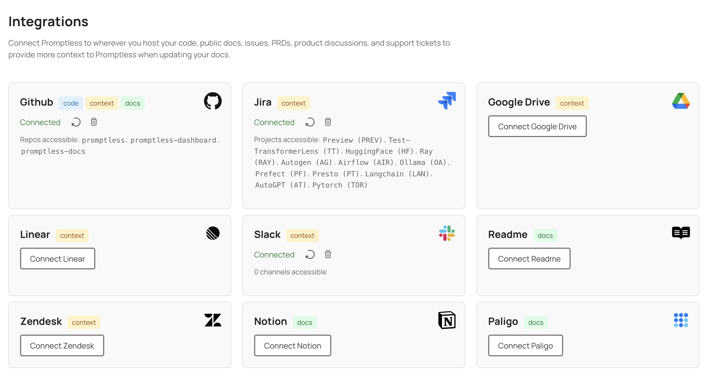

# Set Up & Quickstart

Promptless automatically updates your docs, saving your team time and improving your customer experience. 

## Before You Start

- Contact our team at [hello@gopromptless.ai](mailto:hello@gopromptless.ai) to get invited to Promptless and start a free trial

## Quick Setup Overview

Get Promptless running in 2 simple steps:

1. **Set up integrations** - Set up integrations for triggers, context sources, and documentation platforms
2. **Create a project** - Configure how and when Promptless should update your docs

## Step 1: Set up integrations

Visit the [Integrations page](https://app.gopromptless.ai/integrations) in your dashboard to connect:

**Triggers**

- **GitHub/Bitbucket**: Auto-trigger from pull requests
- **Slack**: Manual triggers via @mentions or message actions
  
**Documentation Platform**

- **GitHub repos**: Most common setup. Supports many hosting providers like ReadMe, Mintlify, Fern, and more. 
- **Hosted CMSs**: Zendesk supported today. More coming soon! 

**Enhanced Context (optional)**: Connect **Linear**, **Jira**, or **Slack** to provide Promptless with additional context for better suggestions.

<Frame>
  
</Frame>

## Step 2: Create a project

Visit the [Projects page](https://app.gopromptless.ai/projects) to create your first project.

### Trigger Configuration

Choose your trigger type:

<Cards>
  <Card title="GitHub/Bitbucket Triggers" icon="fa-code-pull-request">
    Automatically runs when PRs are opened in specified source repositories.
  </Card>
  <Card title="Slack Triggers" icon="brands slack">
    Runs when you @mention Promptless or use Slack message shortcuts.
  </Card>
</Cards>

<Info>
Need both trigger types? Create separate projects with identical settings for each trigger.
</Info>

### Project Configuration Options

<ParamField path="Context Sources" type="optional">
  Select which Linear teams, Jira projects, or other sources to search for context
</ParamField>

<ParamField path="Excluded Directories" type="optional">
  Specify directories to exclude from analysis (internal docs, deprecated content, etc.)
</ParamField>

<ParamField path="Auto-publish" type="boolean">
  Automatically create PRs with documentation changes
</ParamField>

<ParamField path="Process Recent PRs" type="boolean">
  Analyze PRs from the last 30 days when creating your project to generate suggestions based on recent code changes
</ParamField>

<Frame>
  
</Frame>

<Tip title="Best Practice">
Create a dedicated Slack channel for documentation update notifications and configure it in your project settings. This helps your team stay coordinated and informed about doc updates.
</Tip>

## What's Next?

After creating a project, Promptless will start ingesting and indexing your documentation. This process helps Promptless learn your documentation structure and content, and remember it for future suggestions. This can take 5-30 minutes, depending on the size of your docs.

Once setup is complete, Promptless will:
- Listen for trigger events from your configured sources
- Analyze changes and gather relevant context
- Generate documentation suggestions for your review

<Success>
You're all set! Promptless is now ready to help automate your documentation updates.
</Success>

Need help with integrations? Contact us at [help@gopromptless.ai](mailto:help@gopromptless.ai) - we add new integrations every week.
