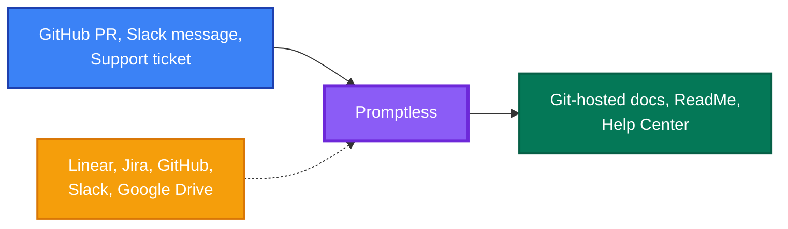

<Info>
All content on this docs site was generated by Promptless. See how in our <a href="https://github.com/Promptless/docs">public docs repo</a>.
</Info>

Promptless automatically generates and updates docs based on your existing product and development workflows. No more undocumented new features, or out-of-date docs that confuse your customers—just fresh, accurate docs that evolve with your product effortlessly.

<CardGroup cols={2}>
  <Card title="For Development Teams" icon="fa-regular fa-code">
    Eliminate docs debt by automatically catching when code changes require doc updates, without disrupting your development workflow.
  </Card>
  
  <Card title="For Technical Writers" icon="fa-regular fa-pen-to-square">
    Focus on information architecture and strategy while Promptless handles the routine updates and maintenance of your docs.
  </Card>
</CardGroup>

## How Promptless Works

Promptless operates through three interconnected components that work together to understand your codebase, gather context, and publish updates automatically.

<CardGroup cols={1}>
  <Card title="Intelligent Triggers" icon="fa-regular fa-bolt" href="/docs/core-concepts/triggers">
    Monitor your development ecosystem for events that indicate documentation needs—from pull requests and code changes to team discussions and support tickets.
  </Card>
  
  <Card title="Contextual Understanding" icon="fa-regular fa-brain" href="/docs/core-concepts/context-sources">
    Enrich docs with real-time access to your organization's knowledge through integrations with project management tools, code repositories, and team communications.
  </Card>
  
  <Card title="Multi-Platform Publishing" icon="fa-regular fa-share-nodes" href="/docs/core-concepts/doc-cm-ss">
    Distribute updates across your entire docs ecosystem—from GitHub-synced platforms to help centers and content management systems.
  </Card>
</CardGroup>

## Key Benefits

<CardGroup cols={2}>
  <Card title="Automated Workflows" icon="fa-regular fa-arrows-rotate">
    Docs updates happen automatically when code changes, eliminating manual monitoring and reducing the risk of outdated information.
  </Card>
  
  <Card title="Contextual Intelligence" icon="fa-regular fa-lightbulb">
    Deep integration with your existing tools means Promptless understands your organization's specific terminology, processes, and doc styles.
  </Card>
  
  <Card title="Enterprise Security" icon="fa-regular fa-shield">
    SOC 2 compliant infrastructure with OAuth integration, role-based access controls, and encryption at rest and in transit.
  </Card>
  
  <Card title="Team Collaboration" icon="fa-regular fa-users">
    Bridges communication gaps between product, engineering, and technical writing teams by automatically detecting when releases impact docs.
  </Card>
</CardGroup>

## Who Uses Promptless

Promptless automatically detects when code changes require documentation updates and notifies your team through your existing workflows.

### Development Teams

When you open a PR, Promptless automatically checks if docs need updating and notifies your team in Slack.

<Frame caption="Promptless notifies your team in Slack when documentation updates are needed">
  
</Frame>

Promptless drafts the initial update based on your PR changes, so you can review and publish without switching between tools.

### Technical Writers  

Promptless automatically detects doc-impacting PRs and sends notifications to your Slack channels, so you stay informed without monitoring a hundred release channels or attending every standup.

<Frame caption="Technical writers are automatically notified when PRs require documentation updates">
  
</Frame>

When reviewing suggestions, all the context you need—PR details, related conversations, issue tickets—is available directly in the web interface.

<Frame caption="View all research and context sources directly in the web interface">
  
</Frame>

<Tip>
Ready to get started? Promptless integrates with your existing tools and workflows to provide immediate value without disrupting your team's productivity.
</Tip>

## Next Steps

<CardGroup cols={3}>
  <Card title="Quick Setup" icon="fa-regular fa-rocket" href="/docs/getting-started">
    Get Promptless running with your repositories and communication tools in under 10 minutes.
  </Card>
  
  <Card title="Core Concepts" icon="fa-regular fa-lightbulb" href="/docs/core-concepts">
    Understand how triggers, context sources, and publishing platforms work together.
  </Card>
  
  <Card title="Integrations" icon="fa-regular fa-plug" href="/docs/integrations">
    Explore all available integrations and configure them for your specific needs.
  </Card>
</CardGroup>
