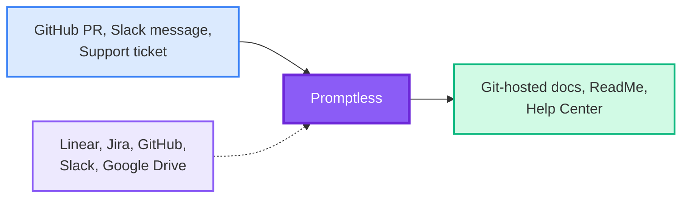

<Info>
All content on this docs site was generated by Promptless.
</Info>

Promptless automatically generates and updates docs based on your existing product and development workflows. No more undocumented new features, or out-of-date docs that confuse your customers—just fresh, accurate docs that evolve with your product effortlessly.

<CardGroup cols={2}>
  <Card title="For Development Teams" icon="fa-regular fa-code">
    Eliminate docs debt by automatically catching when code changes require doc updates, without disrupting your development workflow.
  </Card>
  
  <Card title="For Technical Writers" icon="fa-regular fa-pen-to-square">
    Focus on information architecture and strategy while Promptless handles the routine updates and maintenance of your docs.
  </Card>
</CardGroup>

## How Promptless Works

Promptless operates through three interconnected components that work together to understand your codebase, gather context, and publish updates automatically.

<CardGroup cols={1}>
  <Card title="Intelligent Triggers" icon="fa-regular fa-bolt" href="/docs/core-concepts/triggers">
    Monitor your development ecosystem for events that indicate documentation needs—from pull requests and code changes to team discussions and support tickets.
  </Card>
  
  <Card title="Contextual Understanding" icon="fa-regular fa-brain" href="/docs/core-concepts/context-sources">
    Enrich docs with real-time access to your organization's knowledge through integrations with project management tools, code repositories, and team communications.
  </Card>
  
  <Card title="Multi-Platform Publishing" icon="fa-regular fa-share-nodes" href="/docs/core-concepts/doc-cm-ss">
    Distribute updates across your entire docs ecosystem—from GitHub-synced platforms to help centers and content management systems.
  </Card>
</CardGroup>

## Key Benefits

<CardGroup cols={2}>
  <Card title="Automated Workflows" icon="fa-regular fa-arrows-rotate">
    Docs updates happen automatically when code changes, eliminating manual monitoring and reducing the risk of outdated information.
  </Card>
  
  <Card title="Contextual Intelligence" icon="fa-regular fa-lightbulb">
    Deep integration with your existing tools means Promptless understands your organization's specific terminology, processes, and doc styles.
  </Card>
  
  <Card title="Enterprise Security" icon="fa-regular fa-shield">
    SOC 2 compliant infrastructure with OAuth integration, role-based access controls, and encryption at rest and in transit.
  </Card>
  
  <Card title="Team Collaboration" icon="fa-regular fa-users">
    Bridges communication gaps between product, engineering, and technical writing teams by automatically detecting when releases impact docs.
  </Card>
</CardGroup>

## Who Uses Promptless

Promptless serves development teams and technical writers who need to maintain accurate, comprehensive docs without sacrificing development velocity.

### Development Teams
- **Reduce Context Switching**: Generate docs without leaving your existing workflows
- **Maintain Consistency**: Ensure docs stay aligned with actual implementation  
- **Scale Documentation**: Support multiple projects without proportional overhead

### Technical Writers  
- **Eliminate Communication Friction**: Stay automatically in the loop for any doc-impacting PRs—no more relying on engineers to remember to inform the docs team
- **Reduce Documentation Backlog**: Connect all necessary context automatically and draft updates, so you don't have to chase down team members for information
- **Enforce Consistent Standards**: Automatically apply your style guides and documentation rules, ensuring quality without manual oversight

<Tip>
Ready to get started? Promptless integrates with your existing tools and workflows to provide immediate value without disrupting your team's productivity.
</Tip>

## Popular Integration Patterns

<CardGroup cols={2}>
  <Card title="GitHub + Slack" icon="fa-brands fa-github" href="/docs/getting-started">
    The most common setup—trigger docs updates from pull requests and team discussions, publish to GitHub-synced docs platforms.
  </Card>
  
  <Card title="Jira + Help Center" icon="fa-regular fa-ticket" href="/docs/integrations">
    Connect project management workflows with customer-facing docs to ensure feature releases include updated help center content.
  </Card>
  
  <Card title="Linear + Multi-Platform" icon="fa-regular fa-diagram-project" href="/docs/integrations">
    Use Linear issues for context while publishing docs updates across multiple platforms simultaneously.
  </Card>
  
  <Card title="Zendesk Integration" icon="fa-regular fa-ticket" href="/docs/integrations/zendesk-integration">
    Monitor Zendesk tickets for documentation gaps and automatically update your help center content when features change or issues arise.
  </Card>
</CardGroup>

## Next Steps

<CardGroup cols={3}>
  <Card title="Quick Setup" icon="fa-regular fa-rocket" href="/docs/getting-started">
    Get Promptless running with your repositories and communication tools in under 10 minutes.
  </Card>
  
  <Card title="Core Concepts" icon="fa-regular fa-lightbulb" href="/docs/core-concepts">
    Understand how triggers, context sources, and publishing platforms work together.
  </Card>
  
  <Card title="Integrations" icon="fa-regular fa-plug" href="/docs/integrations">
    Explore all available integrations and configure them for your specific needs.
  </Card>
</CardGroup>
