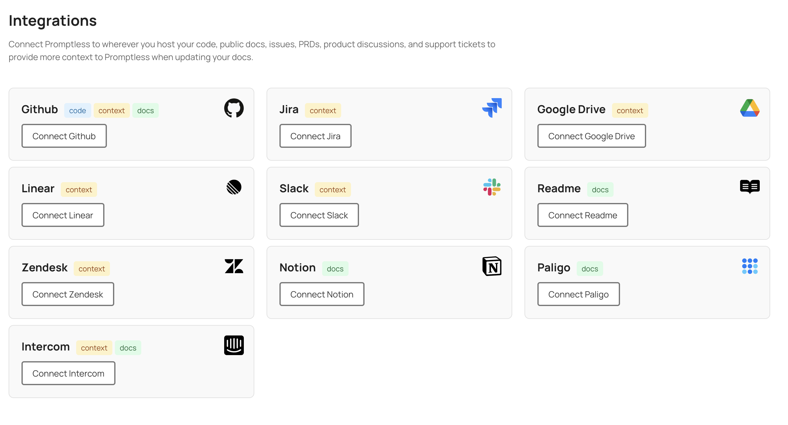
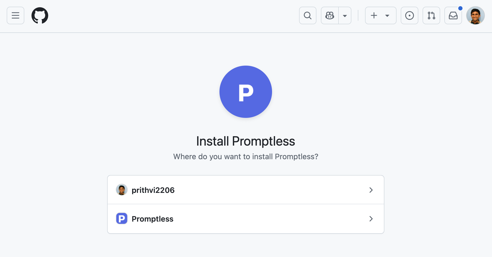
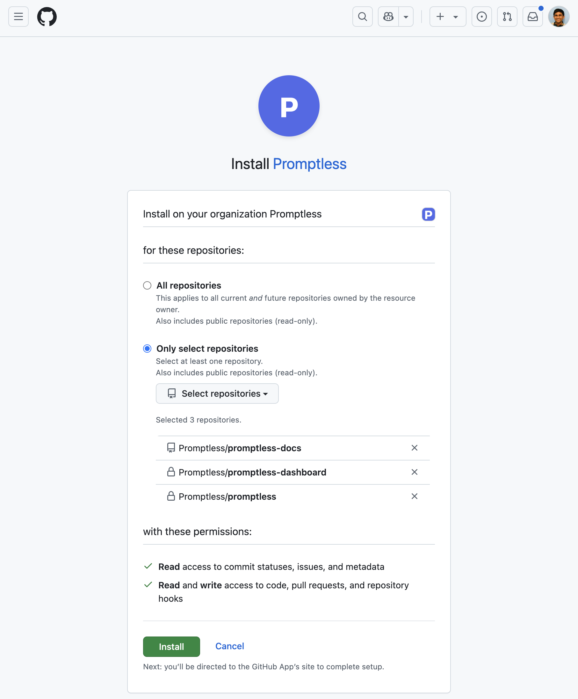

# GitHub Integration

**Used for: Triggers, Context, and Publishing**

Promptless integrates with GitHub through our official GitHub App, providing secure access to your repositories for documentation automation. You can trigger documentation updates from pull requests or direct commits to your default branch.

<Info>
**GitHub Enterprise Users**: If you're using GitHub Enterprise Server or GitHub Enterprise Cloud with restricted third-party app access, see our [GitHub Enterprise Setup Guide](/docs/integrations/github-enterprise-integration) for custom GitHub App configuration instructions.
</Info>

## Installation

1. Click "Connect GitHub" from the [integrations page](https://app.gopromptless.ai/integrations). 
<Frame>
  
</Frame>

2. Enter your GitHub organization name and select which org to install Promptless into. 
<Frame>
  
</Frame>

3. Select which repositories you want to give Promptless access to. Typically, this will be your source code and your documentation repo (if your docs are in GitHub).  
<Frame>
  
</Frame>

4. Verify that Promptless is connected in the integrations page. 
<Frame>
  
</Frame>

## Connecting Multiple GitHub Organizations

You can connect multiple GitHub organizations to your Promptless account. This is useful for managing work and personal repositories, or when working across multiple organizations.

After you connect your first organization, click the "Connect another GitHub Org" button on the integrations page to add more. Each new organization follows the same installation process.

Each connected organization appears as its own card on the integrations page, showing:
- Organization name
- List of accessible repositories
- Individual refresh and disconnect controls

When creating or editing projects, repositories from all connected organizations are available in the dropdown menus, displayed as `organization/repository`.

## Adding More Repos After Installation

After the initial installation, you may need to add new repositories or modify which repositories Promptless can access. You can manage this directly through your GitHub organization settings:

1. Navigate to your GitHub organization settings
2. Go to "Third-party Access" → "GitHub Apps" 
3. Find "Promptless" in the list and click "Configure"
4. In the "Repository access" section, you can:
   - Switch between "All repositories" and "Only select repositories"
   - Add or remove specific repositories using the "Select repositories" dropdown
   - Remove repositories by clicking the "×" next to their names

<Frame>
  
</Frame>

5. Click "Save" to apply your changes

After updating repository access, the new repositories will be available when creating or editing projects in Promptless. Note that it may take a few minutes for the changes to be reflected in the Promptless dashboard. If you don't see newly added repositories immediately, you may need to click the "refresh repos" icon in the integrations page to update the repository list.

## Authentication Model

Promptless uses the official [GitHub App specification](https://docs.github.com/en/apps/creating-github-apps/about-creating-github-apps) to authenticate with GitHub. Promptless authenticates securely with JWTs generated by the GitHub App installation. 

This ensures that Promptless has read and write access to the repositories that you select, and that either you or Promptless can revoke access at any time.

## What You Can Do with GitHub

Once connected, you can use GitHub for:

- **[Triggers](/docs/configuration/triggers)**: Monitor pull requests and commits for documentation updates
- **[Context Sources](/docs/configuration/context-sources/github)**: Search code repositories and issues for technical context
- **[Doc Collections](/docs/configuration/doc-collections/github-repos)**: Publish documentation updates to GitHub-based platforms

## Frequently Asked Questions

<AccordionGroup>
  <Accordion title="How do I add more repositories after installing the GitHub integration?">
    Add additional repositories anytime by visiting your GitHub organization settings. In GitHub, head to `Settings -> Third-party Access -> GitHub Apps` then find the Promptless GitHub App and click "Configure." Add or remove repositories in the "Repository access" section, then click "Save." You'll be able to choose from the newly added repositories when creating or editing your Promptless projects.
  </Accordion>

  <Accordion title="Can I remove GitHub repository access from Promptless?">
    You can remove access to specific repositories or even uninstall the integration entirely from the same "Configure" page in your GitHub organization settings. Click the `×` next to a repository name to remove it from the Promptless GitHub App, or click the `Uninstall` button at the bottom of the page to remove the app entirely.
  </Accordion>

  <Accordion title="How long does it take for repository changes to appear in Promptless?">
    It may take a few minutes for repository updates in the GitHub App to be reflected in your Promptless dashboard. If you don't see newly added repositories right away when creating or editing projects, click the "refresh repos" icon in the integrations page.
  </Accordion>

  <Accordion title="Can I connect multiple GitHub organizations to one Promptless account?">
    Yes. After connecting your first GitHub organization, you can add more by clicking "Connect another GitHub Org" on the integrations page. Each organization appears as its own card, and repositories from all connected organizations are available when setting up projects.
  </Accordion>
</AccordionGroup>
