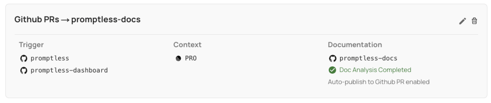

# GitHub Integration

**Used for: Triggers, Context, and Publishing**

Promptless integrates with GitHub through our official GitHub App.

<Info>
**GitHub Enterprise Users**: See our [GitHub Enterprise Setup Guide](/docs/integrations/github-enterprise-integration) for custom GitHub App configuration.
</Info>

## Installation

1. Click the "Connect GitHub" button from the [integrations page](https://app.gopromptless.ai/integrations). 
<Frame>
  
</Frame>

2. Select your GitHub organization. 
<Frame>
  
</Frame>

3. Select repositories for Promptless to access (typically your source code and docs repos).  
<Frame>
  
</Frame>

4. Verify the connection on the integrations page. 
<Frame>
  
</Frame>

## Adding More Repos After Installation

Add or remove repositories anytime through your GitHub organization settings:

1. Go to **Settings** → **Third-party Access** → **GitHub Apps** → **Promptless** → **Configure**
2. Update repository access in the "Repository access" section
3. Click **Save**

<Frame>
  
</Frame>

New repositories will be available when creating or editing projects in Promptless. If you don't see them right away, click the "refresh repos" icon on the integrations page.

## Project Setup and Permissions

Create a project in the [projects page](https://app.gopromptless.ai/projects) to select trigger and documentation repositories. Promptless has read-only access to trigger repos and read-write access to documentation repos.

<Frame>
  
</Frame>

## Trigger Events in Pull Request Descriptions

Promptless PRs include trigger events in the description, providing context for reviewers:
- Links to original sources (Slack threads, GitHub PRs, support tickets)
- Brief descriptions of what triggered the update
- Easy navigation to review the context behind the changes

## Directory-Specific Triggers

Configure Promptless to only trigger when changes are made to specific directories:

1. When creating or editing a project, select the GitHub trigger option
2. Check "Choose specific directories to trigger this project"
3. Enter directory paths (comma-separated for multiple)
4. Save your configuration

<Frame>
  
</Frame>

Only PRs with changes to specified directories will trigger documentation updates.

## Authentication Model

Promptless uses the [GitHub App specification](https://docs.github.com/en/apps/creating-github-apps/about-creating-github-apps) with JWT authentication for secure access. Either you or Promptless can revoke access anytime.
## Frequently Asked Questions

### How do I add more repositories after installing the GitHub integration?

Visit your GitHub organization settings: **Settings** → **Third-party Access** → **GitHub Apps** → **Promptless** → **Configure**. Add or remove repositories in the "Repository access" section and click **Save**.

### Can I remove GitHub repository access from Promptless?

Remove access to specific repositories or uninstall the integration entirely from the same "Configure" page. Click **×** next to a repository to remove it, or click **Uninstall** to remove the app completely.

### How long does it take for repository changes to appear in Promptless?

Repository updates may take a few minutes to reflect in your Promptless dashboard. Click the "refresh repos" icon on the integrations page if you don't see newly added repositories immediately.
