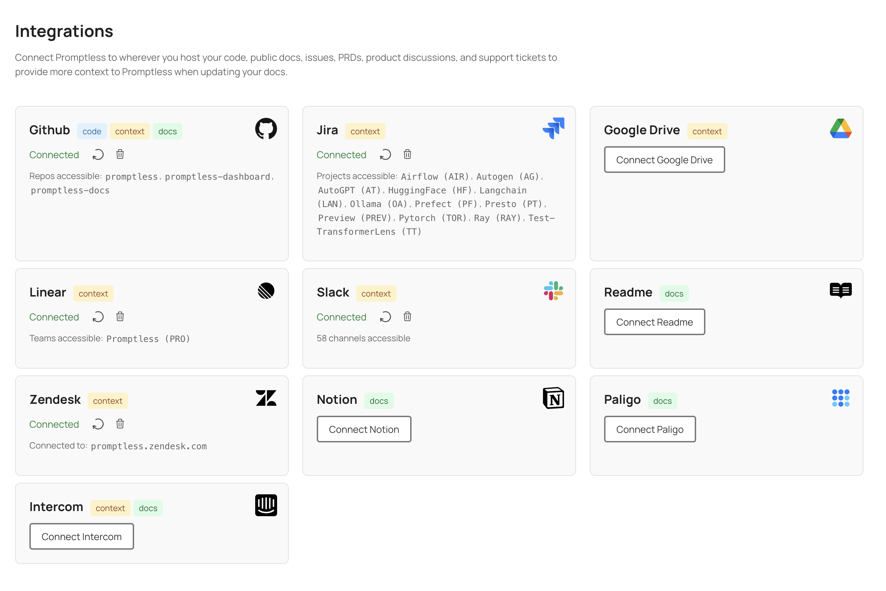

# GitHub Integration

**Used for: Triggers, Context, and Publishing**

Promptless integrates with GitHub through our official GitHub App, providing secure access to your repositories for documentation automation.

<Info>
**GitHub Enterprise Users**: If you're using GitHub Enterprise Server or GitHub Enterprise Cloud with restricted third-party app access, see our [GitHub Enterprise Setup Guide](/docs/integrations/github-enterprise-integration) for custom GitHub App configuration instructions.
</Info>

## Installation

1. Click "Connect GitHub" from the [integrations page](https://app.gopromptless.ai/integrations). 
<Frame>
  
</Frame>

2. Select which GitHub org you want to install Promptless into. 
<Frame>
  
</Frame>

3. Select which repositories you want to give Promptless access to. Typically, this will be your source code and your documentation repo (if your docs are in GitHub).  
<Frame>
  
</Frame>

4. Verify that Promptless is connected in the integrations page. 
<Frame>
  
</Frame>

## Managing Repository Access After Installation

After the initial installation, you may need to add new repositories or modify which repositories Promptless can access. You can manage this directly through your GitHub organization settings:

1. Navigate to your GitHub organization settings
2. Go to "Third-party Access" → "GitHub Apps" 
3. Find "Promptless" in the list and click "Configure"
4. In the "Repository access" section, you can:
   - Switch between "All repositories" and "Only select repositories"
   - Add or remove specific repositories using the "Select repositories" dropdown
   - Remove repositories by clicking the "×" next to their names

<Frame>
  
</Frame>

5. Click "Save" to apply your changes

After updating repository access, the new repositories will be available when creating or editing projects in Promptless. Note that it may take a few minutes for the changes to be reflected in the Promptless dashboard. If you don't see newly added repositories immediately, you may need to click the "refresh repos" icon in the integrations page to update the repository list.

## Project Setup and Permissions

After setting up the integration, you'll be able to create a project in the [projects page](https://app.gopromptless.ai/projects). When creating a project, you'll be able to select trigger repositories and documentation repositories. Promptless will have read-only access to the repositories that you select as trigger repositories, and will have write access to the repositories that you select as documentation repositories. 

For example, in the below example, Promptless is only able to read the `promptless` and `promptless-dashboard` repos, but is able to read and write to the `promptless-docs` repo. 

<Frame>
  
</Frame>

## Trigger Events in Pull Request Descriptions

When Promptless creates a pull request for documentation updates, it automatically includes a list of the trigger events that led to those changes in the PR description. This provides valuable context for reviewers and creates clear traceability between documentation updates and their originating events.

The trigger events section in the PR description includes:
- Links back to the original source (e.g., Slack threads, GitHub PRs, support tickets)
- Brief descriptions of what triggered the documentation update
- Easy navigation to review the context that prompted the changes

This feature helps you understand why documentation changes were made and provides a clear audit trail for all updates.

## Directory-Specific Triggers

You can configure Promptless to only trigger when changes are made to specific directories within your repositories. This is particularly useful when you want to focus documentation updates on changes to certain parts of your codebase, such as changelog directories.

To set up directory-specific triggers:

1. When creating or editing a project, select the GitHub trigger option
2. Check the "Choose specific directories to trigger this project" option
3. Enter the directory paths you want to monitor, separating multiple paths with commas
4. Save your project configuration

<Frame>
  
</Frame>

Once configured, your specified trigger directories will be visible in the project list view, making it easy to see which directories are being monitored for each project.

When trigger directories are specified, only PRs that contain changes to those directories will be considered, and updates to other files will be ignored. 

## Automated CI Check and Build Issue Resolution

When Promptless opens a documentation PR, it automatically monitors the pull request for quality issues. If CI checks fail, linting tools report errors, Vale rules trigger warnings, or your documentation hosting provider detects broken links or build problems, Promptless will automatically analyze the issues and push fixes directly to the PR branch.

This automated issue resolution works seamlessly with your existing GitHub workflow - there's no additional configuration needed. Quality problems get resolved in the background while you focus on content rather than troubleshooting technical issues.

## Authentication Model

Promptless uses the official [GitHub App specification](https://docs.github.com/en/apps/creating-github-apps/about-creating-github-apps) to authenticate with GitHub. Promptless authenticates securely with JWTs generated by the GitHub App installation. 

This ensures that Promptless has read and write access to the repositories that you select, and that either you or Promptless can revoke access at any time.