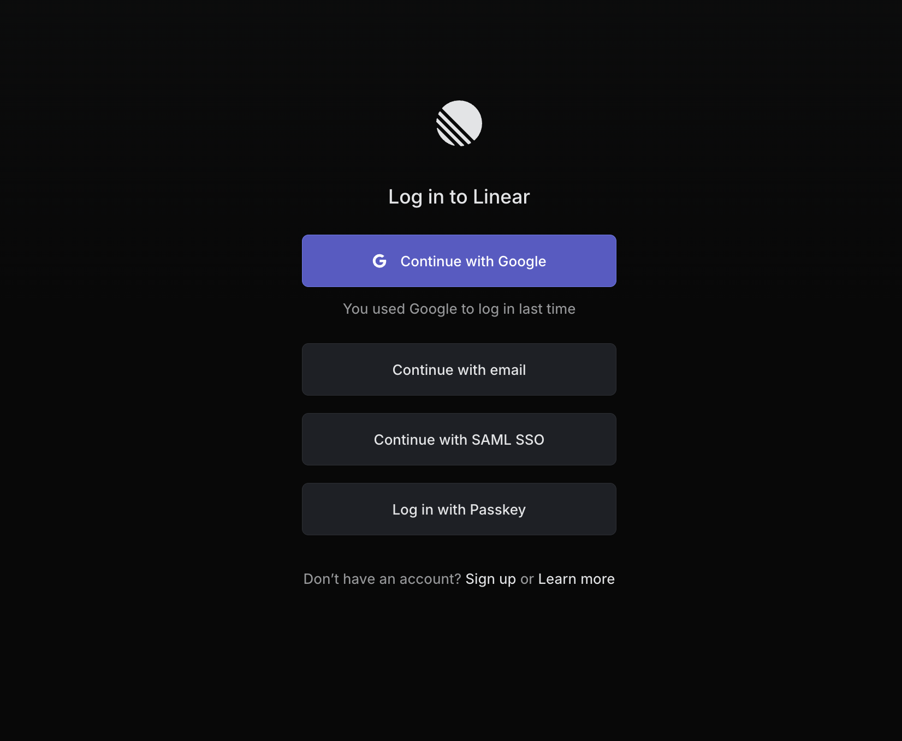
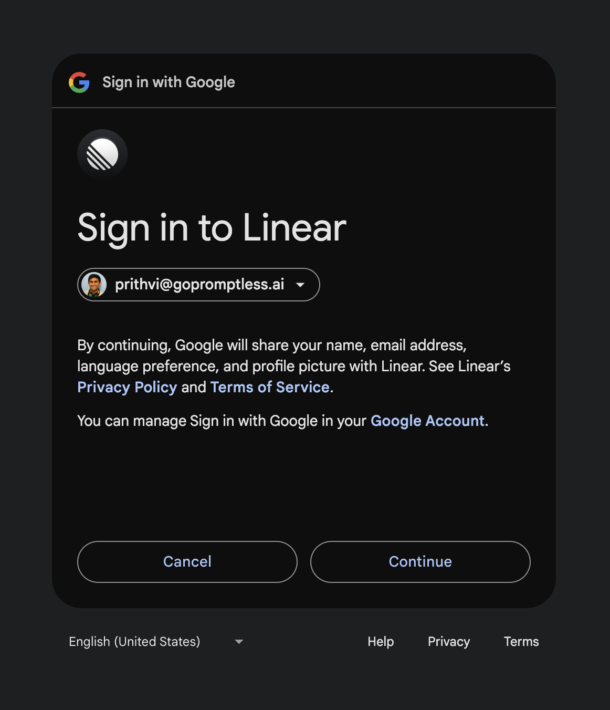

# Linear Integration

**Used for: Context**

Promptless integrates with Linear through OAuth 2.0, providing secure access to your project management data for documentation automation.

## Installation

1. Click "Connect Linear" from the [integrations page](https://app.gopromptless.ai/integrations).
<Frame>
  
</Frame>

2. You'll be redirected to Linear to sign in to the right organization, if you are not already signed into the web app.
<Frame>
  
</Frame>
<Frame>
  
</Frame>

3. Once you're signed in, you'll be redirected back to Promptless, and you can verify that Linear is connected.
<Frame>
  
</Frame>

## Project Setup and Permissions

After connecting Linear, you can configure which teams you'd like Promptless to search within when setting up a Project in the [projects page](https://app.gopromptless.ai/projects). Promptless will not be able to search within teams that you do not select. 

For example, in the below example project, Promptless will only search within the `PRO` team for relevant issues.  

<Frame>
  
</Frame>

## Authentication Model

Promptless uses OAuth 2.0 to authenticate with Linear, following their [official Linear OAuth 2.0 specification](https://developers.linear.app/docs/oauth/authentication). This ensures:

- Secure token-based authentication
- Ability to revoke access at any time
- Granular permission control at the team level
- Regular token rotation for enhanced security

