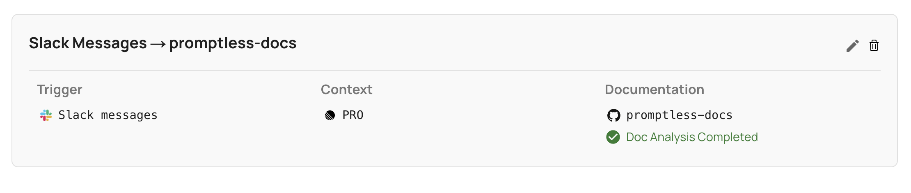

# Slack Integration

**Used for: Triggers**

Promptless integrates with Slack through our official Slack App, enabling automated documentation updates based on team communication and support conversations.

## Installation

1. Click "Connect Slack" from the [integrations page](https://app.gopromptless.ai/integrations).
<Frame>
  
</Frame>

2. You'll be redirected to Slack to install the Promptless app. **Be sure to select the right workspace to install Promptless.**
<Frame>
  
</Frame>

3. Review and approve the requested permissions for the Promptless Slack app. Promptless requires these permissions to be able to be triggered from the right events in Slack and to notify your team when updates are available.
<Frame>
  
</Frame>

<Info title="Understanding Slack Permissions">
  Promptless requests broader permissions than it currently uses to support potential future features like searching across Slack threads for relevant context. Currently, Promptless only accesses threads when you explicitly tag @Promptless or use the "Update Docs" message action. Promptless does not actively monitor or read any channels.
</Info>

4. Verify that Slack is connected in the integrations page.
<Frame>
  
</Frame>

## Project Setup and Permissions

After installing the Slack app, you can configure new projects in the [projects page](https://app.gopromptless.ai/projects) to be set up to trigger from Slack. 

Below is an example of a project that is set up to trigger from Slack. 

<Frame>
  
</Frame>

Once the Project is created, you will be able to trigger Promptless by writing @Promptless in a Slack channel, or by clicking Slack "Update Docs" message action on any thread. When you perform either of these actions, Promptless will pull the entire thread it was tagged in, and identify the right documentation updates based on the contents of that thread. 

### Optional: Passive Channel Listening

You can optionally enable passive listening for specific channels. When enabled, Promptless will automatically monitor conversations in your selected channels and create documentation suggestions when threads become inactive.

To enable passive listening:
1. Edit your Slack trigger project
2. Check the box for "Listen for all messages in specific channels"
3. Select which channels to monitor
4. Save your configuration

Passive listening is completely opt-in and only applies to channels you explicitly select. For more details, see [Working with Slack](/docs/features/slack-interactions#4-passive-channel-listening).

<Warning title="Privacy and Channel Access">
  By default, Promptless only reads Slack content when you explicitly trigger it by tagging @Promptless or using the "Update Docs" message action. If you enable passive listening, Promptless will monitor only the specific channels you select in your project configuration. Promptless cannot access private channels unless it has been specifically invited to those channels.
</Warning> 

## Image and File Attachment Processing

Promptless can process images and file attachments shared in Slack threads when triggered, enhancing documentation with visual elements and additional context when appropriate.

### How It Works

1. When you tag @Promptless or use the "Update docs" message action in a thread containing images or file attachments, Promptless will analyze both the text and attached files in the thread.

2. Promptless evaluates whether the images or file content provide valuable context that should be included in the documentation.

3. If an image or file is deemed relevant, Promptless will:
   - Upload the image to a secure S3 bucket managed by Promptless
   - Extract and incorporate relevant content from file attachments (including images from PDFs)
   - Include the image in the documentation updates it suggests
   - Format the image appropriately for the documentation platform

4. When reviewing the suggestion in the Promptless app, you'll see the added images at the bottom of the review interface, allowing you to approve or reject their inclusion.

For practical examples of using images and file attachments when triggering Promptless, see [Working with Slack](/docs/features/slack-interactions).

<Frame>
  
</Frame>

### Managing Images

After images have been added to your documentation, you can manage them through the Promptless dashboard:

1. Navigate to the Change History page for the specific documentation update
2. Scroll to the Created Assets section at the bottom of the page
3. From here, you can:
   - View a preview of each image
   - Edit an image by clicking on it to open the screenshot editor (crop, add annotations, shapes, text, arrows)
   - Copy the URL of an image to use elsewhere
   - Delete an image if it's no longer needed

**Important:** When you delete an image, it's permanently removed from both the database and storage. If the image is referenced in any documentation, you'll need to manually update that content to remove or replace the reference to the deleted image.

### Permission Requirements

This feature requires additional Slack permissions to access images in threads. If you installed the Slack app before this feature was released, you'll need to reinstall it:

1. Go to the [integrations page](https://app.gopromptless.ai/integrations)
2. Delete the existing Slack integration
3. Re-add the Slack app to grant the new permissions

**Note:** File attachment processing supports images, PDFs, and other common file types directly shared in Slack threads, including files from external links.

## Permission Scope and Usage

### What Promptless Actually Does

By default, Promptless operates on an **explicit trigger model** with Slack:

- **Only reads content when triggered**: Promptless only accesses Slack messages when you explicitly tag @Promptless or use the "Update Docs" message action
- **Thread-based processing**: When triggered, Promptless reads the entire thread to understand context, but only for that specific thread
- **No background monitoring by default**: Unless you enable passive listening for specific channels, Promptless does not scan, monitor, or automatically read messages in any channels

If you enable **passive channel listening** (optional):
- **Selective monitoring**: Promptless will monitor only the specific channels you explicitly select in your project configuration
- **Automatic suggestions**: When threads become inactive, Promptless analyzes the conversation and creates documentation suggestions when appropriate
- **Full control**: You can add or remove channels from passive listening at any time

### Why Broader Permissions Are Requested

The Slack app requests broader permissions than currently used to support potential future features:

- **Future search capabilities**: We've designed the permission scope to potentially allow searching across Slack threads for relevant context (similar to searching through documentation)
- **Customer-requested features**: Some customers have specifically asked for the ability to search historical Slack conversations for documentation context
- **Optional future functionality**: If we add these features, they would be **opt-in configuration options** that you control

## Authentication Model

Promptless uses Slack's [official App authentication](https://api.slack.com/authentication), which provides:

- Secure OAuth 2.0 token-based authentication
- Granular permission scopes
- Ability to revoke access at the workspace or channel level
- Regular token rotation for enhanced security

