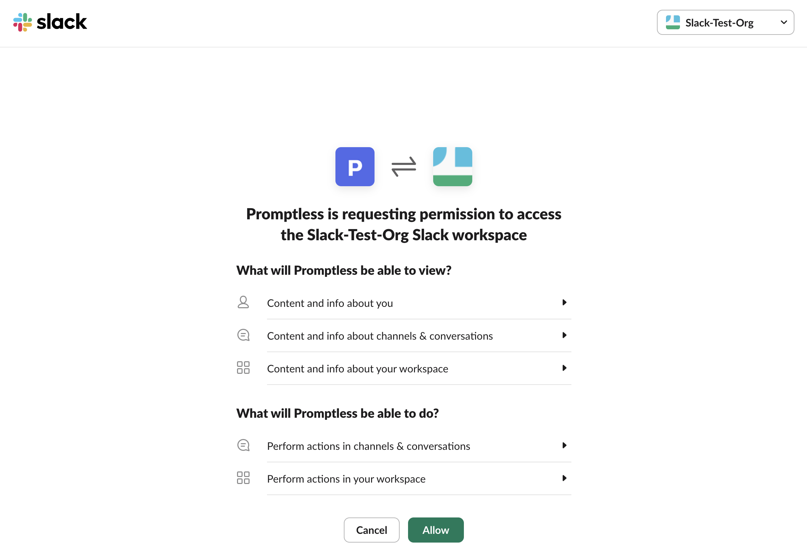
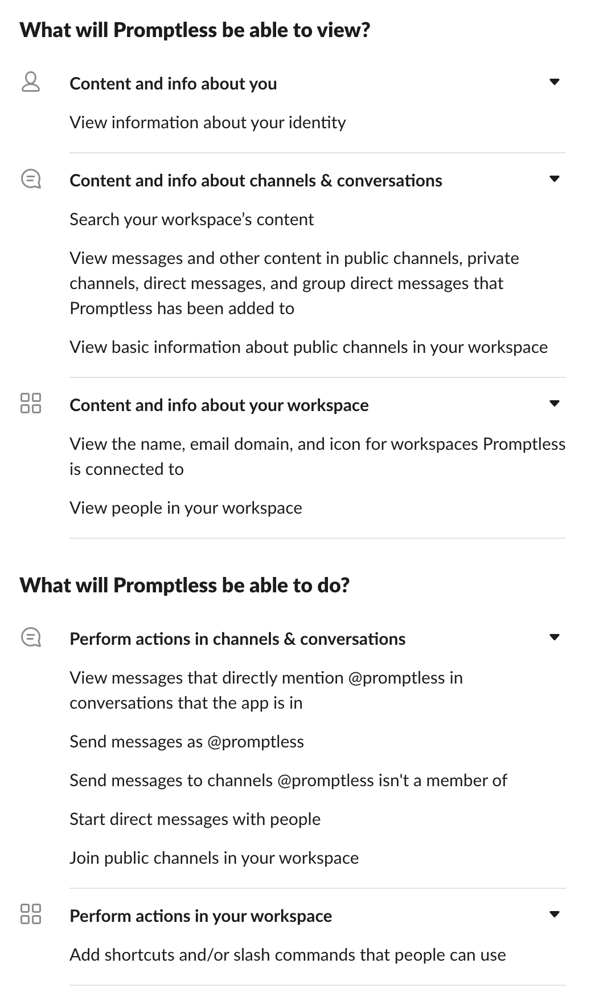

# Slack Integration

**Used for: Triggers and Context**

Promptless integrates with Slack through our official Slack App, enabling automated documentation updates based on team communication and support conversations.

Promptless does not archive or store your Slack messages.

Disclaimer: Promptless uses LLMs from OpenAI and Anthropic that have the potential to generate inaccurate results.

## Installation

1. Click "Connect Slack" from the [integrations page](https://app.gopromptless.ai/integrations).
<Frame>
  
</Frame>

2. You'll be redirected to Slack to install the Promptless app. **Be sure to select the right workspace to install Promptless.**
<Frame>
  
</Frame>

3. Review and approve the requested permissions for the Promptless Slack app. Promptless requires these permissions to be able to be triggered from the right events in Slack and to notify your team when updates are available.
<Frame>
  
</Frame>

<Info title="Understanding Slack Permissions">
  Promptless requests broader permissions than it currently uses to support potential future features like searching across Slack threads for relevant context. Currently, Promptless only accesses threads when you explicitly tag @Promptless or use the "Update Docs" message action. Promptless does not actively monitor or read any channels.
</Info>

4. Verify that Slack is connected in the integrations page.
<Frame>
  
</Frame>

## What You Can Do with Slack

Once connected, you can use Slack for:

- **[Triggers](/docs/configuration/triggers/slack)**: Tag @Promptless or use message actions to trigger documentation updates
- **[Context Sources](/docs/configuration/context-sources/slack)**: Search Slack conversations for team discussions and decisions

## Privacy and Channel Access

By default, Promptless only reads Slack content when you explicitly trigger it by tagging @Promptless or using the "Update Docs" message action. If you enable passive listening in your project settings, Promptless will monitor only the specific channels you select. Promptless cannot access private channels unless it has been specifically invited to those channels.

For more details about using Slack with Promptless, see [Working with Slack](/docs/features/slack-interactions).
