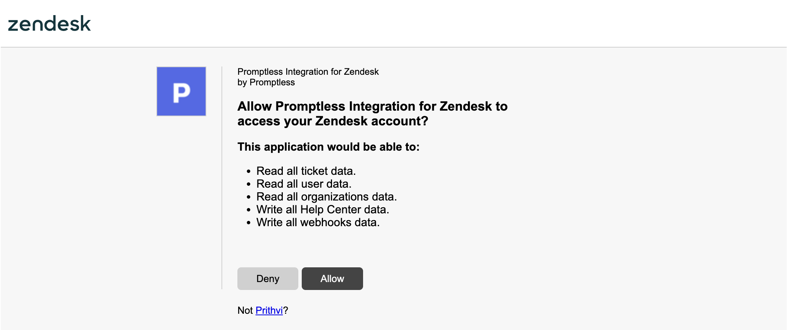

# Zendesk Integration

**Used for: Triggers and Publishing**

Promptless integrates with Zendesk through OAuth 2.0. This enables automated documentation updates based on support ticket patterns and customer interactions. It also enables publishing updates to Zendesk's Help Center.

## Installation

1. Click "Connect Zendesk" from the [integrations page](https://app.gopromptless.ai/integrations).

2. Review the requested permissions and approve the Promptless app.
<Frame>
  
</Frame>

3. Verify that Zendesk is connected in the integrations page.

## Project Setup and Permissions

After connecting Zendesk, configure ticket monitoring settings on the [projects page](https://app.gopromptless.ai/projects). When setting up a project: 

- Set up a Zendesk trigger to notify Promptless when a ticket is resolved
- Set up publishing to publish updates to the Zendesk Help Center 

<Frame>
  [TODO: add screenshot showing the project configuration interface with Zendesk trigger and publishing options]
</Frame>

## Authentication Model

Promptless uses Zendesk's [official OAuth 2.0 authentication](https://developer.zendesk.com/api-reference/introduction/security-and-auth/):

- Secure token-based authentication
- Granular API access scopes
- Revoke access at any time
- Regular token rotation